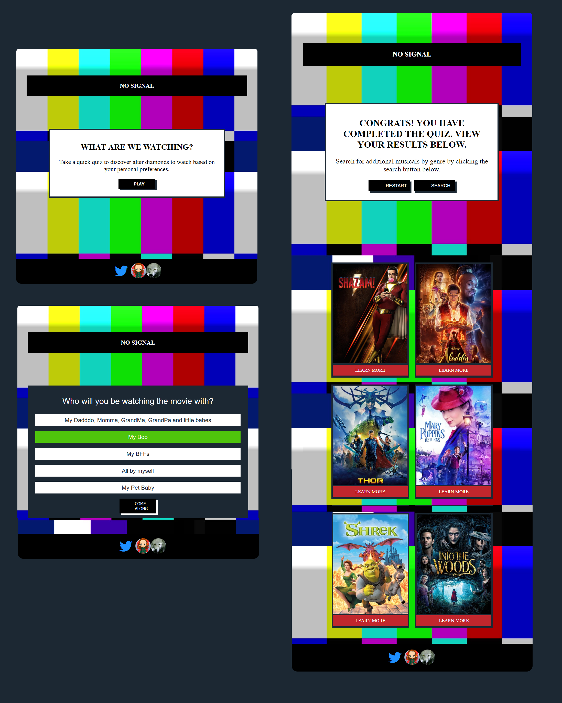

# What-are-we-watching?
## JQuery Quiz

## Summary
There are hundreds of possible movie choices for us to discover. This app helps users narrow down their choices based on their personal preferences. Users take a short quiz that will determine the genre they are most interested in. Based on the user quiz responses, recommendations for movies will be displayed after the quiz has been completed. 

## Technology Used
HTML
CSS (Sass)
JavaScript
jQuery
The Movie Database API
Adobe Illustrator

## Demo

